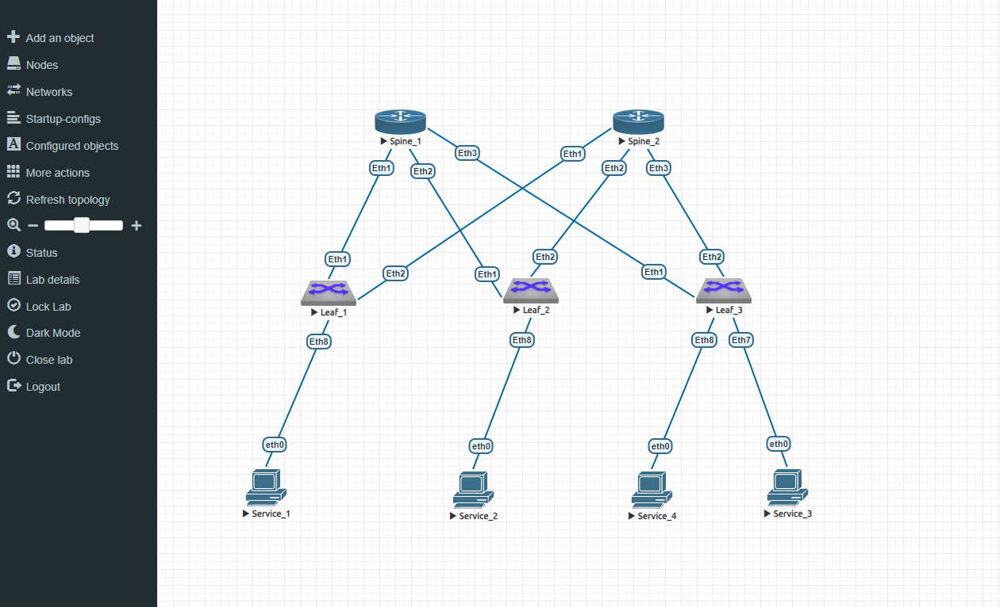
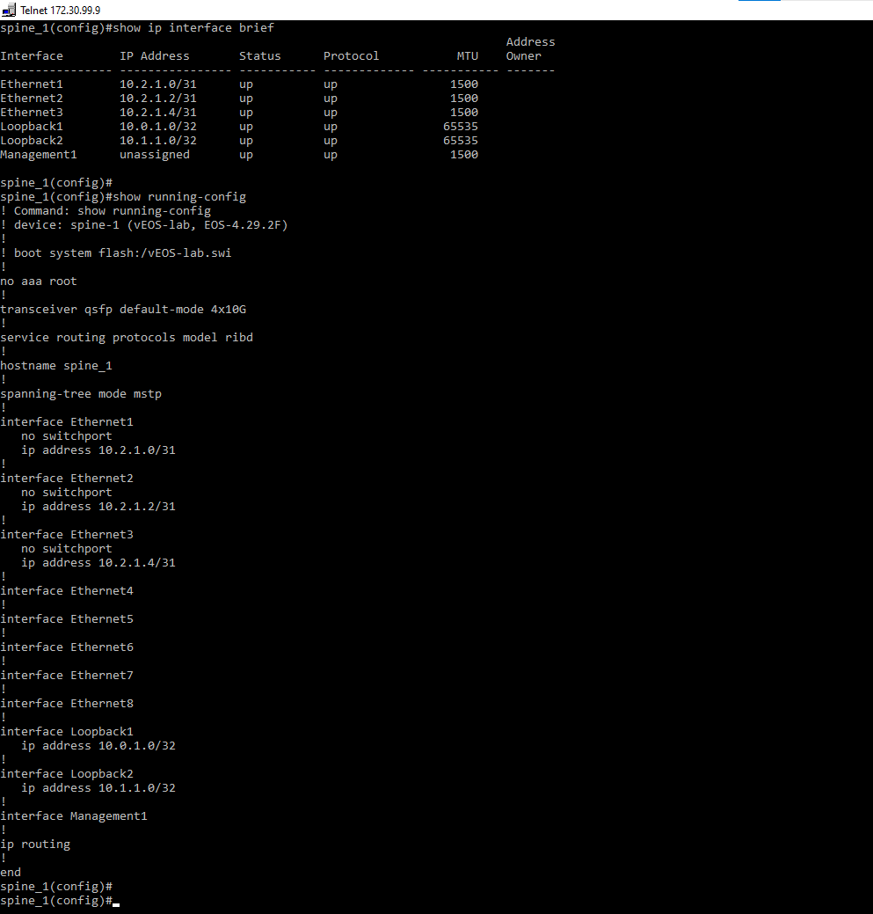
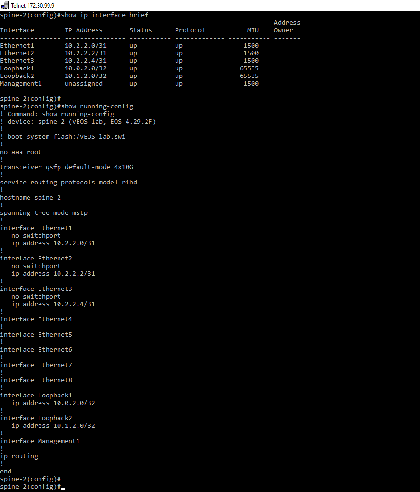
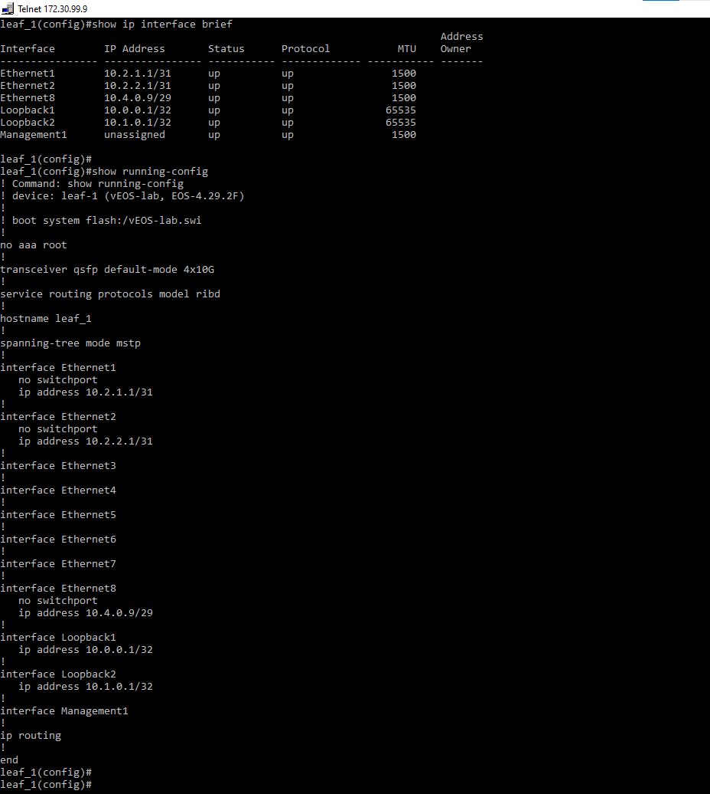
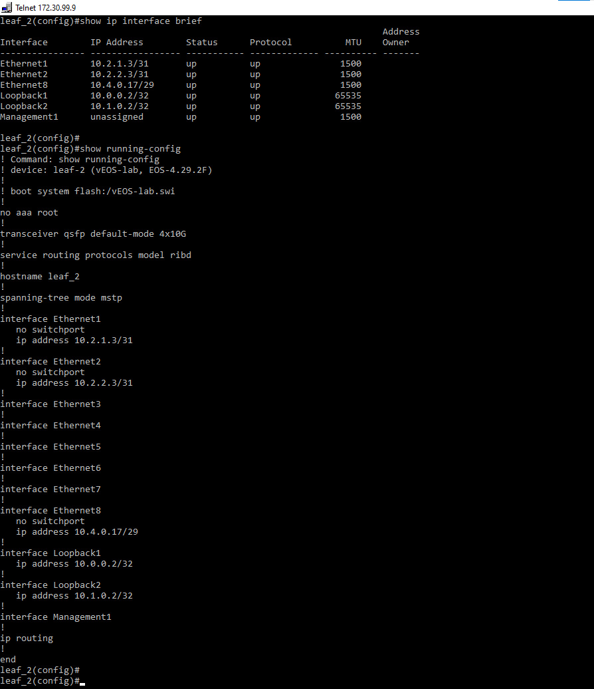
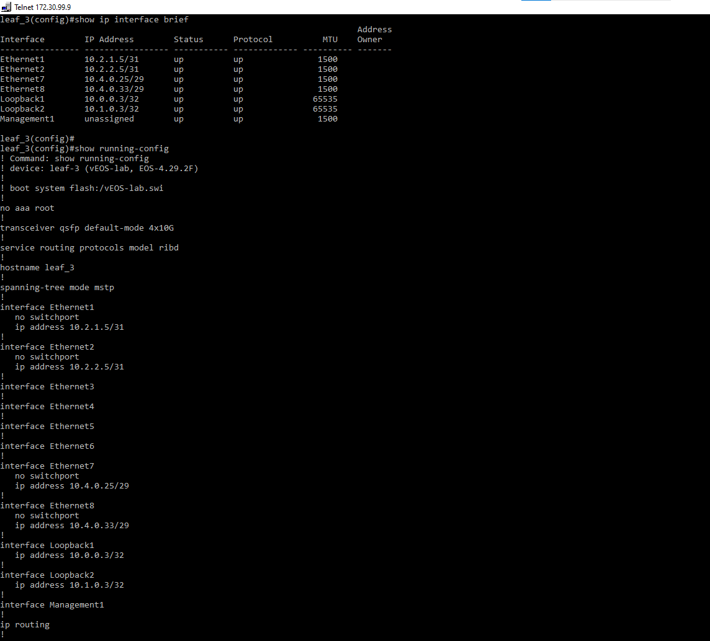
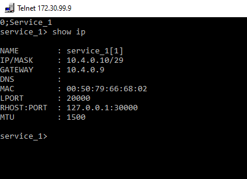
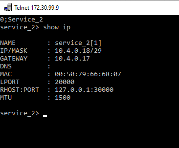
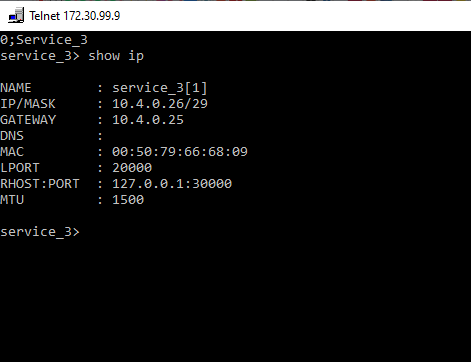
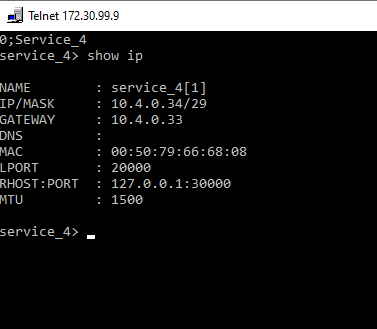

### Лабораторная работа 1. Проектирование адресного пространства

### Цели:
- Собрать схему CLOS;
- Распределить адресное пространство;

### IP адресация:
Распределение IP адресов для Одного ЦОДа.

DC1  
0 – Lo1 (/16) (8*(N-1)) 
10.0.0.0/16 

1 – Lo2 (/16) (8*(N-1) + 1) 
10.1.0.0/16 

Суммарный для Lo1 и Lo2 – 10.0.0.0/15 

2 – p2p links (/16) (8*(N-1) + 2) 
10.2.0.0/16 

3 – резерв (/16) (8*(N-1) + 3) 
10.3.0.0/16 

Суммарный для p2p и резерва – 10.2.0.0/15 
[4 .. 7] – services (/16) (8*(N-1) + [4 .. 7]) 
10.4.0.0/16 
10.5.0.0/16 
10.6.0.0/16 
10.7.0.0/16 
Суммарный – 10.4.0.0/14 

DC1 – 10.0.0.0/13 
DC2 – 10.8.0.0/13 
… 
DCN – 10.8*(N-1).0.0/13 
N = [1 .. 32] 

### Распределение IP-адресов на интерфейсы:
Device|Interface|IP Address|Subnet Mask
---|---|---|---
spine-1|lo1|10.0.1.0|255.255.255.255
||lo2|10.1.1.0|255.255.255.255
||eth1|10.2.1.0|255.255.255.254
||eth2|10.2.1.2|255.255.255.254
||eth3|10.2.1.4|255.255.255.254
spine-2|lo1|10.0.2.0|255.255.255.255
||lo2|10.1.2.0|255.255.255.255
||eth1|10.2.2.0|255.255.255.254
||eth2|10.2.2.2|255.255.255.254
||eth3|10.2.2.4|255.255.255.254
leaf-1|lo1|10.0.0.1|255.255.255.255
||lo2|10.1.0.1|255.255.255.255
||eth1|10.2.1.1|255.255.255.254
||eth2|10.2.2.1|255.255.255.254
||eth8|10.4.0.9|255.255.255.248
leaf-2|lo1|10.0.0.2|255.255.255.255
||lo2|10.1.0.2|255.255.255.255
||eth1|10.2.1.3|255.255.255.254
||eth2|10.2.2.3|255.255.255.254
||eth8|10.4.0.17|255.255.255.248
leaf-3|lo1|10.0.0.3|255.255.255.255
||lo2|10.1.0.3|255.255.255.255
||eth1|10.2.1.5|255.255.255.254
||eth2|10.2.2.5|255.255.255.254
||eth7|10.4.0.25|255.255.255.248
||eth8|10.4.0.33|255.255.255.248
service_1|eth0|10.4.0.10|255.255.255.248
service_2|eth0|10.4.0.18|255.255.255.248
service_3|eth0|10.4.0.26|255.255.255.248
service_4|eth0|10.4.0.34|255.255.255.248

#### Конфигурация оборудования

#### spine_1

#### spine_2

#### leaf_1

#### leaf_2

#### leaf_3

#### service_1

#### service_2

#### service_3

#### service_4

